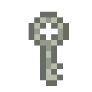

Dungeon-crawler project
=======================
#### *Author: Kan Sofia*

## Description

The game takes place in the imaginary kingdom. The protagonist is tasked by the alchemist guild
with clearing the ruin of an old underground fortress overtaken by goblins. The end goal is to
find the entrance to the farthest room of the fortress and clear the way from goblins.

Player would take the control over the adventurer and work on this quest.

## Table of contents 
* [New Features list](#new-features-list)
* [Levels](#levels)
* [Installation](#installation)
* [Future Development](#future-development)
* [Game/Lore Wiki](#gamelore-wiki)
* [Credits](#credits)

## New features List

* 5 new enemies, 6 new items, 6 new obstacles
* 7 new levels (10 total) 
* Game soundtrack and 15 new sounds
* Fighting mechanics with abilities, health, and balanced enemies 
* Doors/keys mechanic
* Jump mechanic for faster movement, obstacles and enemies skipping
* Resurrection/lives mechanic
* Pause game, mute music features, and other Quality of Life features
* Intricate level design and ability to return to previous levels
* Statistic screen after win
* Defeat screen
* New game+ with new items, additional levels and enemy re-balance

### Levels

The main game consists of 10 levels of the old dungeon.

The new game+ sends the victorious player to the new dungeon with even more powerful enemies and difficult
obstacles. New Game+ consists of 12 levels.

## Installation

1) Install [CLion](https://www.jetbrains.com/en-en/clion/download)
2) Install vckpg package manager from CLion
3) Setup necessary dependencies 
   * Linux: `libxinerama-dev libxcursor-dev xorg-dev libglu1-mesa-dev pkg-config curl zip unzip tar`
   * macOS: `libxinerama libxcursor xorg-server pkg-config glfw`
4) Install raylib using vcpkg
5) Configure CMake target for the dungeon project
6) Build the project using the CMake

## Future development

* Major rewrite with OOP patterns
* Add dynamic entities (monster movement, flying fireballs, moving objects)
* Non-linear level structure
* Advanced combat (abilities, various damage types, effects)
* Inventory
* New Combat items (weapons, armor, spells)
* Better ui
* More sounds and soundtracks
* Game saves
* Procedural generation of levels and items

## Game/Lore wiki

### Items

* #### Apple

Apples are widespread in the kingdom. 98% of apples are produced by a single farm of
a rich alchemist. So they tend to have healing and preservative properties -
the exact reason is unknown. Goblins and gnomes like their smell, but can 
not withstand the taste, so they do not eat them.

Technical: Item for restoring health points. Gives 10 HP.

* #### Small potion

Small potions are illegally brewed by alchemists in the kingdom from the apples in an
attempt to extract the secret of the apple's healing properties. However, no one has 
succeeded yet. Goblins sense the apples in the potions, so they like to hoard them
in their camps.

Technical: Item for restoring health points. Gives 30 HP.

* #### Big Potion

Big potions are officially created by the alchemist guild from the tusks of trolls.
Goblins believe that feeding these potions to trolls, would increase their productivity,
however, no evidence of that was found. The potion is quite watery, and some adventurers
have a suspicion that guild dilutes the troll extract for profit.

Technical: Item for restoring health points. Gives 50 HP.

* #### Coin

Coins with the image of king. Favourite goblins loot: they love the shine of gold.
However, coins themselves are made of rose gold - mix of copper and a bit of gold.

Technical: Item for earning score. Gives 10 score.

* #### Diamond

Diamonds are rocks of mysterious properties. They are largely used for weapons and 
armor crafting in the kingdom, and thus are highly valued. Goblins use them as currency.

Technical: Item for earning score. Gives 20 score.

### Enemies

* #### Simple goblin

Goblins are a widespread race of malicious creatures. They invade many dungeons,
caves and ruins, trying to rob adventurers and traders. Goblins tend to hoard their loot,
so it is common to find a lot of treasures in their nests.

Technical: Simple Goblin has 40 HP. His damage is 20. You can't skip him. If you win him, you gain 250 score.

* #### Great Goblin

Great Goblins are furious warriors and leaders of their clans.
Their size allows them to sustain a lot of damage.
Beware of their knocking strike!

Technical: Great Goblin has 100 HP. His damage is 30. You can't skip him. If you win him, you gain 100 score.

* #### Gnome

Gnomes are a thief race. They try to rob travellers by scaring them with their look.
However, gnomes are not particularly dangerous, as they are quite weak. Because of their
kleptomaniac nature, it is quite often to find some healing potions and extracts in their pockets. 

Technical: Gnome has 50 HP. His damage is 0, but he takes 40 score with each strike.
You can't skip him. If you win him, you gain 150 score and 40 health.

* #### Troll

Trolls are animal-like creatures held by goblins as a stock. Though, they look tough,
goblins tend to make them less dangerous for farming purposes by filing their tusks.
Trolls are valued in alchemy, because their extracts can be used for 
the best healing potions.

Technical: Troll has 80 HP. His damage is 15. You can skip him. If you win him, you gain 200 score and 70 health.

* #### Spider

Spiders are another animals that invade caves and dungeons. Goblins are not fond of them,
but try to not provoke them for a conflict. Sometimes you can find a spider tamed by goblins,
but that is quite rare. Their precious silk is very expensive, as it can be used for 
creation of exquisite garments. The spider silk has anti-inflammatory properties, so it is
often used for medical supplies.

Technical: Spider has 65 HP. His damage is 25. You can skip him. If you win him, you gain 175 score and 40 health.

### Obstacles

* #### Spike

Spikes are the remains of old trap systems. 
Goblins use them to demarcate territory. Spikes are always poisoned with deadly venom,
so if you step on them, you will die.

Technical: Spike is a constant obstacle. If you step on them, you will die.

* #### Snake

Dungeon snakes are held by goblins as stocks for their venom. The venom is used 
for protection on spikes and for goblin medicine. Some believe that this is homeopathy. 
They create the spike venom, so their bite is as dangerous as the spikes themselves.

Technical: Snake is a constant obstacle. If you step on them, you will die.

* #### Fire

Goblins love to start fires in the caves, burning the magic spruce. The spruce does
not give smoke and lasts long, but is not extremely hot.

Technical: Fire is a constant obstacle. Every time you step on it, you lose 15 HP.

* #### Bomb

Gnomes like to play with bombs, annoying goblins.

Technical: Bomb is not a constant obstacle. If you step on it, you lose 10 HP and it disables.

* #### Silver key and door

Goblins and gnomes find keys and doors to be extremely fun. They like to lock doors
and hide keys. This is a traditional game of the goblin culture. Sometimes, gnomes do
their own traditional game by stealing keys and hiding them even further.

Technical: Silver door is an obstacle if you do not have a silver key. Once you have silver key and interact with the door, it disables. 
For every silver door, you need its own key.

* #### Gold key and door

Old major entrances in fortresses were studded with rose gold. That made goblins' and
gnomes' even more interested in playing with them.

Technical: Gold door is an obstacle if you do not have a gold key. Once you have gold key and interact with the door, it disables.
For every gold door, you need its own key.

## Credits
All sounds used in this project are royalty free and were downloaded from:
[Pixabay](https://pixabay.com/).
